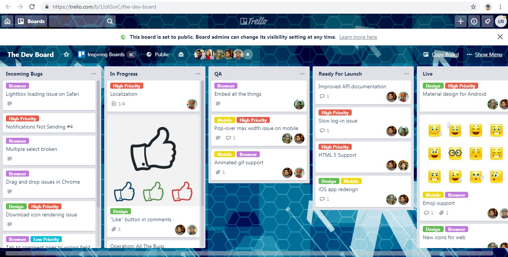
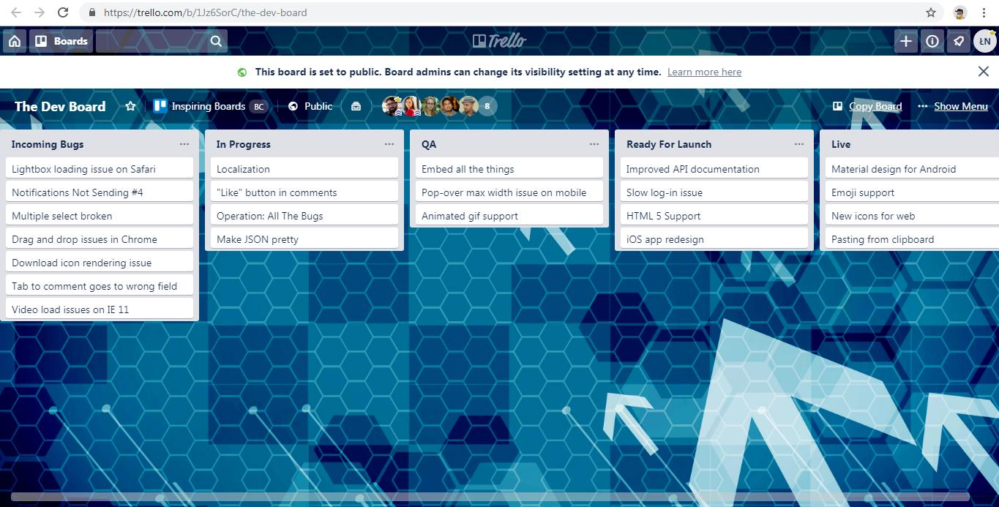

# Trello Clutterless View

This is a bookmarklet to hide all card details except names in a Trello board.

## Example
**Before:**


**After:**


*These screenshots are of a public Trello board [The Dev Board](https://trello.com/b/1Jz6SorC/the-dev-board).*

## Installation

Drag the following link to your bookmarks bar: <a href='javascript:(function(){const t=document.body.getAttribute("clutterless-visible"),e=null==t||"false"===t;document.body.setAttribute("clutterless-visible",e);let l=document.querySelectorAll(".list-card-details > .list-card-labels, .list-card-details > .badges, .list-card-details > .list-card-members, .list-card > .list-card-cover, .list-card > .list-card-stickers-area");if(l.length){for(const t of l)t.style.display=e?"none":"";l=document.querySelectorAll(".list-card > .list-card-details");for(const t of l)t.style.marginTop=e?"0":"";l=document.querySelectorAll(".list-card-details > .list-card-title");for(const t of l)e?(t.style.prevmargin=t.style.margin,t.style.margin="0"):t.style.margin=t.style.prevmargin;l=document.querySelectorAll(".list-card");for(const t of l)e?(t.style.prevmarginBottom=t.style.marginBottom,t.style.marginBottom="4px"):t.style.marginBottom=t.style.prevmarginBottom}const s=document.querySelector(".js-add-list");s&&(s.style.display=e?"none":"");const o=document.querySelectorAll(".js-list");for(const t of o)if(e){const e=0===t.querySelectorAll(".list-cards > .list-card:not(.hide)").length;t.style.display=e?"none":""}else t.style.display="";const r=document.querySelectorAll(".open-card-composer");for(const t of r)t.style.display=e?"none":""})();'>Trello Cluterless View</a>

Alternatively, manually add a bookmark with any title (for example "Trello Clutterless View") and with the following code as the link address (URL):

```
javascript:(function(){const t=document.body.getAttribute("clutterless-visible"),e=null==t||"false"===t;document.body.setAttribute("clutterless-visible",e);let l=document.querySelectorAll(".list-card-details > .list-card-labels, .list-card-details > .badges, .list-card-details > .list-card-members, .list-card > .list-card-cover, .list-card > .list-card-stickers-area");if(l.length){for(const t of l)t.style.display=e?"none":"";l=document.querySelectorAll(".list-card > .list-card-details");for(const t of l)t.style.marginTop=e?"0":"";l=document.querySelectorAll(".list-card-details > .list-card-title");for(const t of l)e?(t.style.prevmargin=t.style.margin,t.style.margin="0"):t.style.margin=t.style.prevmargin;l=document.querySelectorAll(".list-card");for(const t of l)e?(t.style.prevmarginBottom=t.style.marginBottom,t.style.marginBottom="4px"):t.style.marginBottom=t.style.prevmarginBottom}const s=document.querySelector(".js-add-list");s&&(s.style.display=e?"none":"");const o=document.querySelectorAll(".js-list");for(const t of o)if(e){const e=0===t.querySelectorAll(".list-cards > .list-card:not(.hide)").length;t.style.display=e?"none":""}else t.style.display="";const r=document.querySelectorAll(".open-card-composer");for(const t of r)t.style.display=e?"none":""})();
```

## Usage

Go to any [Trello](https://trello.com) board and click the bookmarklet to hide or show the card details.

## Development

Report bugs and ask for features [here](https://github.com/lukaszmn/Trello-Clutterless-View/issues).

## Documentation

Please visit [my blog](https://lukasznojek.com/blog/2019/04/trello-power-up-to-hide-labels-and-fields-from-card-covers/).
